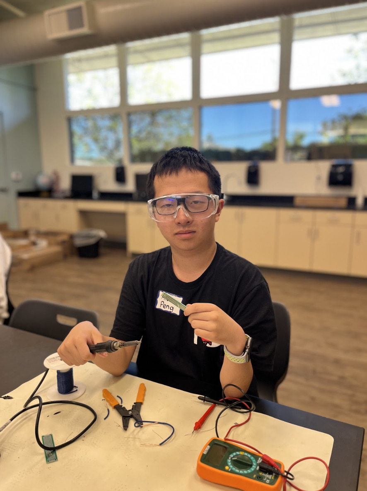

# Voice Assistant with AI

My project can naturally speak with humans and comprehend their requests by sending it to ChatGPT and speaking the response aloud. Using Rasberry Pi, this voice assistant can help with a variety of tasks which the user can ask. A modification that can be added to this project is enabling bikers to say "left" or "right" where the robot will turn on a corresponding light to alert drivers behind them which way they are turning.


| **Name** | **School** | **Area of Interest** | **Grade** |
|:--:|:--:|:--:|:--:|
| Alex P | Henry M Gunn High School | AI/ML | Rising Sophomore




<!---**Replace the BlueStamp logo below with an image of yourself and your completed project. Follow the guide [here](https://tomcam.github.io/least-github-pages/adding-images-github-pages-site.html) if you need help.**

-->
  
# Final Milestone

<iframe width="560" height="315" src="https://www.youtube.com/embed/Z-ffhlgsmoc?si=eDM4dhBXzh9Ra5ae" title="YouTube video player" frameborder="0" allow="accelerometer; autoplay; clipboard-write; encrypted-media; gyroscope; picture-in-picture; web-share" referrerpolicy="strict-origin-when-cross-origin" allowfullscreen></iframe>

<!---For your final milestone, explain the outcome of your project. Key details to include are:
- What you've accomplished since your previous milestone
- What your biggest challenges and triumphs were at BSE
- A summary of key topics you learned about
- What you hope to learn in the future after everything you've learned at BSE-->

## Description
In this milestone, my accomplishments was making the voice assistant work. Now, when I speak a prompt, the Raspberry Pi will recognize the voice and convert the speech to text. Then, it will send the prompt to OpenAI's ChatGPT. There, ChatGPT will generate a resposne and the Raspberry Pi will speak out the response for me. 


## Challenges
The biggest challenges at BSE included learning about wires and resistors for turning on and off the light. Other challenges included debugging and finding the root causes of errors such as skipping lines of code and selecting the wrong speaker.

## Summary
I learned about many key topics in this camp, including AI and electrical engineering. I learned about using OpenAI's developer platform to connect with ChatGPT in my project. I also learned about wires and resistors and how turn on a LED light using them. Moreover, I learned about PCBs, terminal lines, and basic CAD/3d printing techniques. In the future, I hope to dive deeper into the AI field and meaningfully apply its power in practical ways.


## Bill of Materials
Here is the list of materials I used for my starter project:

| **Part** | **Note** | **Price**
|:--:|:--:|:--:|
| Raspberry Pi 4 | The Raspberry Pi 4 is the main operating system for my project. | $61.61
| 4K Video Capture Card | This item displays the Raspberry Pi operating system on my computer. | $15.99
| Canakit Piswitch USB-C | This item connects the Raspberry Pi to my computer. | $12.99
| USB Mini Speaker Computer Speaker | This is the speaker that speaks out the response. | $12.99
| USB 2.0 Mini Microphones | This is the microphone which I speak to. | $8.99
| Basics USB Wired Computer Keyboard (QWERTY) and Mouse Bundle Pack | This includes the keyboard and mouse which I use on the Raspberry Pi screen. | $14.54


# Code
<!---Here's where you'll put your code. The syntax below places it into a block of code. Follow the guide [here]([url](https://www.markdownguide.org/extended-syntax/)) to learn how to customize it to your project needs. -->

```python
import lgpio
import speech_recognition as sr
import pyttsx3
import openai

# Initializing pyttsx3
listening = True
engine = pyttsx3.init()

# Set your openai api key and customize the chatgpt role
openai.api_key = "ABC"
messages = [{"role": "system", "content": "Your name is Tom and give answers in 2 lines"}]

# Customizing the output voice
voices = engine.getProperty('voices')
rate = engine.getProperty('rate')
volume = engine.getProperty('volume')

# Define the GPIO pin number for the relay
RELAY_GPIO_PIN = 18

# Initialize the GPIO
h = lgpio.gpiochip_open(4)

# Set up GPIO pin as output for the relay
lgpio.gpio_claim_output(h, RELAY_GPIO_PIN)

def get_response(user_input):
    messages.append({"role": "user", "content": user_input})
    response = openai.ChatCompletion.create(
        model="gpt-3.5-turbo",
        messages=messages
    )
    ChatGPT_reply = response["choices"][0]["message"]["content"]
    messages.append({"role": "assistant", "content": ChatGPT_reply})
    return ChatGPT_reply

def turn_on_light():
    lgpio.gpio_write(h, RELAY_GPIO_PIN, 1)
    print("Light turned ON")

def turn_off_light():
    lgpio.gpio_write(h, RELAY_GPIO_PIN, 0)
    print("Light turned OFF")

while listening:
    with sr.Microphone() as source:
        recognizer = sr.Recognizer()
        recognizer.adjust_for_ambient_noise(source)
        recognizer.dynamic_energy_threshold = 3000

        try:
            print("Listening...")
            audio = recognizer.listen(source, timeout=5.0)
            response = recognizer.recognize_google(audio)
            print(response)

            if "tom" in response.lower():
           
                response_from_openai = get_response(response)
                engine.setProperty('rate', 120)
                engine.setProperty('volume', volume)
                engine.setProperty('voice', 'greek')
                engine.say(response_from_openai)
                engine.runAndWait()
            
            elif "turn on the light" in response.lower():
                turn_on_light()

            elif "turn off the light" in response.lower():
                turn_off_light()
                
            else:
                print("Didn't recognize 'turn on the light' or 'turn off the light'.")

        except sr.UnknownValueError:
            print("Didn't recognize anything.")

# Clean up GPIO on exit
lgpio.gpiochip_close(h)
print("GPIO cleanup completed")
```


# Second Milestone

<!---**Don't forget to replace the text below with the embedding for your milestone video. Go to Youtube, click Share -> Embed, and copy and paste the code to replace what's below.**-->

<iframe width="560" height="315" src="https://www.youtube.com/embed/jt88gU1Xxh8?si=skl07EsoL68rqDc2" title="YouTube video player" frameborder="0" allow="accelerometer; autoplay; clipboard-write; encrypted-media; gyroscope; picture-in-picture; web-share" referrerpolicy="strict-origin-when-cross-origin" allowfullscreen></iframe>

<!---For your second milestone, explain what you've worked on since your previous milestone. You can highlight:
- Technical details of what you've accomplished and how they contribute to the final goal
- What has been surprising about the project so far
- Previous challenges you faced that you overcame
- What needs to be completed before your final milestone-->

## Description
In this milestone, my accomplishment is installing the dependencies required for the Raspberry Pi to convert speech to text as well as sending the prompt back to OpenAI's ChatGPT in a virtual enviornment. I also changed the default mode for audio devices by changing the card number in the default configuration. The next thing that needs to be completed before my final milestone is to code and execute the python script which will then activate the robot to listen for any prompts. Then it will send it back to ChatGPT and speak out loud a reponse.

## Challenges
Challenges that occurred was downloading the dependencies that involved "pip". This was because I did not install previous lines of code resulting in an error whenever I tried downloading those dependencies. Another challenge was making sure that I download the dependencies in the right folder, or the python script would not work later.

# First Milestone

<!---**Don't forget to replace the text below with the embedding for your milestone video. Go to Youtube, click Share -> Embed, and copy and paste the code to replace what's below.**-->

<iframe width="560" height="315" src="https://www.youtube.com/embed/KPPbzZ2AoVM?si=vwx5OK1yuR2AlYvu" title="YouTube video player" frameborder="0" allow="accelerometer; autoplay; clipboard-write; encrypted-media; gyroscope; picture-in-picture; web-share" referrerpolicy="strict-origin-when-cross-origin" allowfullscreen></iframe>

<!---**For your first milestone, describe what your project is and how you plan to build it. You can include:
- An explanation about the different components of your project and how they will all integrate together
- Technical progress you've made so far
- Challenges you're facing and solving in your future milestones
- What your plan is to complete your project**-->

## Description
My project is the Voice Assistant with AI. The first step is to insert the SD card in my Raspberry Pi, which will serve as the basic storage system for my robot. I plan to build this through using OBS to connect my Raspberry Pi to my computer and then inserting my code there in the terminal. So far, I have successfully managed to do this and have been able to edit in the terminal. The next step is installing the dependencies and changing the default mode for audio devices so that the robot may recognize human voice and then convert it to text. Then it will send the prompt to ChatGPT and speak out the response.

## Challenges
Challenges that occurred was connecting the Raspberry Pi to OBS. The result is a black screen displayed on OBS. The debugging process is selecting the "+" sign, selecting Video Capture Device, and then selecting USB Video.

# Starter project

<iframe width="560" height="315" src="https://www.youtube.com/embed/KVOnv4-s2qQ?si=DQyoTVDBob2fWpel" title="YouTube video player" frameborder="0" allow="accelerometer; autoplay; clipboard-write; encrypted-media; gyroscope; picture-in-picture; web-share" referrerpolicy="strict-origin-when-cross-origin" allowfullscreen></iframe>

## Description
In my starter project, I created a Calculator which can solve basic arithmetic expressions by using an integrated circuit. Moreover, there is also a mode where the resisitor's resistance value will be displayed when given an input of a sequence of colors. I chose this project due to the practical use of a calculator in everyday life as well as the project's involvement with soldering, which is very important for many hardware projects.

## Challenges
A challenge that ocurred during the making of this project was soldering the wrong part. This led me to spending significantly more time desoldering and resoldering. Accidentally soldering parts also caused the top row of the LED display to malfunction and stop displaying.

## Bill of Materials
Here is the list of materials I used for my starter project:

| **Part** | **Note** | **Price**
|:--:|:--:|:--:|
| DIP-28 IC Socket | The integrated circuit is the device that calculates the arithmetic expressions. | $9.49
| LED display | This item displays the input and the output. | $7.69
| Micro USB Socket | This is where the USB charger goes in, to power the calculator | $9.99
| CR2032 battery | The battery is another way to power the calculator. | $5.69
| Acrylic plates | These plates surround the calculator, protecting the board and the wires. | $4.99

<!---# Schematics-->
<!---Here's where you'll put images of your schematics. [Tinkercad](https://www.tinkercad.com/blog/official-guide-to-tinkercad-circuits) and [Fritzing](https://fritzing.org/learning/) are both great resoruces to create professional schematic diagrams, though BSE recommends Tinkercad becuase it can be done easily and for free in the browser. -->

<!---# Code-->
<!---Here's where you'll put your code. The syntax below places it into a block of code. Follow the guide [here]([url](https://www.markdownguide.org/extended-syntax/)) to learn how to customize it to your project needs. 

```c++
void setup() {
  // put your setup code here, to run once:
  Serial.begin(9600);
  Serial.println("Hello World!");
}

void loop() {
  // put your main code here, to run repeatedly:

}
```
-->
<!---# Bill of Materials-->
<!---Here's where you'll list the parts in your project. To add more rows, just copy and paste the example rows below.
Don't forget to place the link of where to buy each component inside the quotation marks in the corresponding row after href =. Follow the guide [here]([url](https://www.markdownguide.org/extended-syntax/)) to learn how to customize this to your project needs. 

| **Part** | **Note** | **Price** | **Link** |
|:--:|:--:|:--:|:--:|
| Item Name | What the item is used for | $Price | <a href="https://www.amazon.com/Arduino-A000066-ARDUINO-UNO-R3/dp/B008GRTSV6/"> Link </a> |
| Item Name | What the item is used for | $Price | <a href="https://www.amazon.com/Arduino-A000066-ARDUINO-UNO-R3/dp/B008GRTSV6/"> Link </a> |
| Item Name | What the item is used for | $Price | <a href="https://www.amazon.com/Arduino-A000066-ARDUINO-UNO-R3/dp/B008GRTSV6/"> Link </a> |
-->
<!---# Other Resources/Examples-->
<!---One of the best parts about Github is that you can view how other people set up their own work. Here are some past BSE portfolios that are awesome examples. You can view how they set up their portfolio, and you can view their index.md files to understand how they implemented different portfolio components.
- [Example 1](https://trashytuber.github.io/YimingJiaBlueStamp/)
- [Example 2](https://sviatil0.github.io/Sviatoslav_BSE/)
- [Example 3](https://arneshkumar.github.io/arneshbluestamp/)

To watch the BSE tutorial on how to create a portfolio, click here.-->
